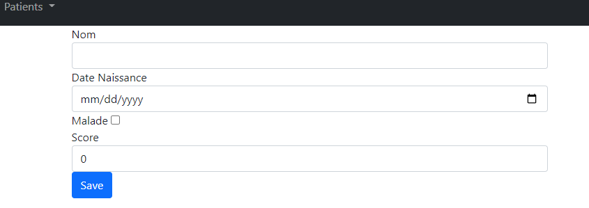
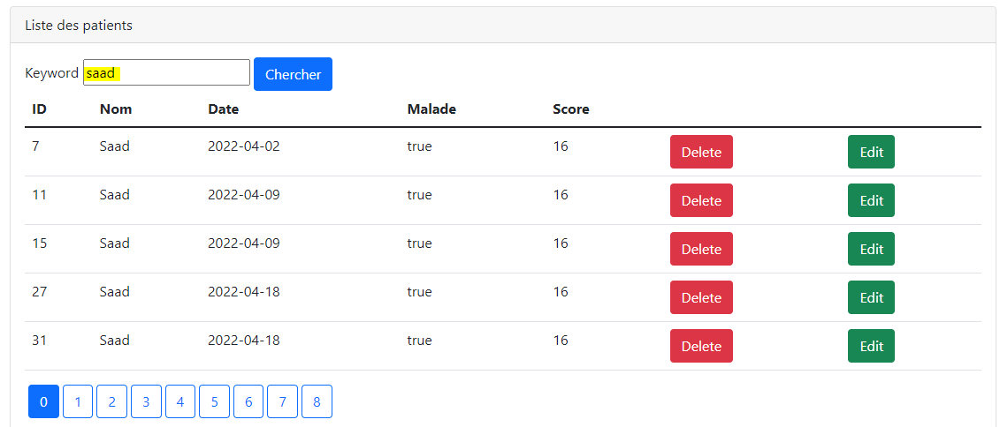
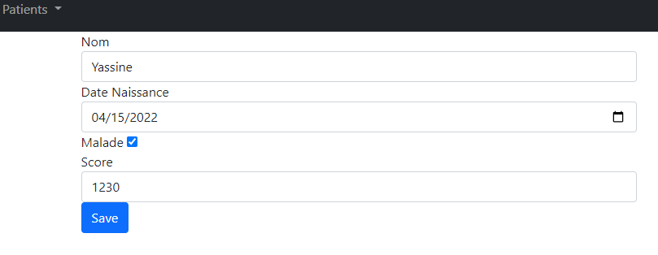

<h2>Compte Rendu</h2>

<h3>Introduction</h3>

Developper une application web besée sur spring
MVC, thymeleaf et spring DATA qui permet de gérer des patients

<h5>Objectif:</h5>

L'application doit permettre de :

-chercher des Patients avec Pagination

-Supprimer un Patient

-Ajouter un Patient avec validation

-Editer et Mettre à jpur un Patient

-Créer une Page Template basée sur Thymeleaf Layout

<h5>Architecure d'une application web</h5>

<h5>Interface:</h5>

Page index

Formulaire d'ajout d'un Patient

Chercher un Patient

Editer les informations d'un Patient

